# Diary
---
## Hosted
[visit website](https://kirttivushantalukdar.pythonanywhere.com/ "Diary")

---

### Overview

1. It is a **CRUD** application .
2. A web app that enables a user to create his/her own **diary** and perform actions like save and delete .
3. _language_ : Python . 
4. _framework_ : Django .

---

#### Home page

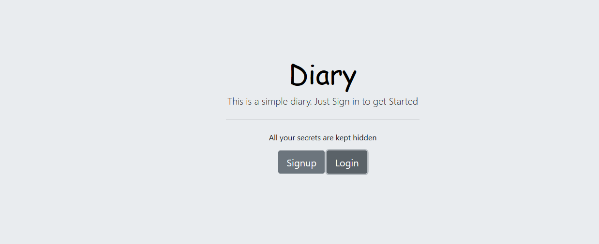

This is the homepage

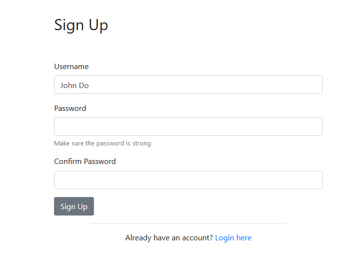

Signing in user

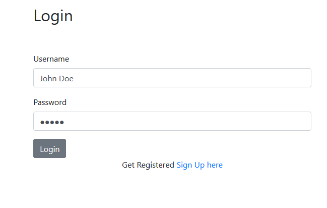

login user

---

#### Web App

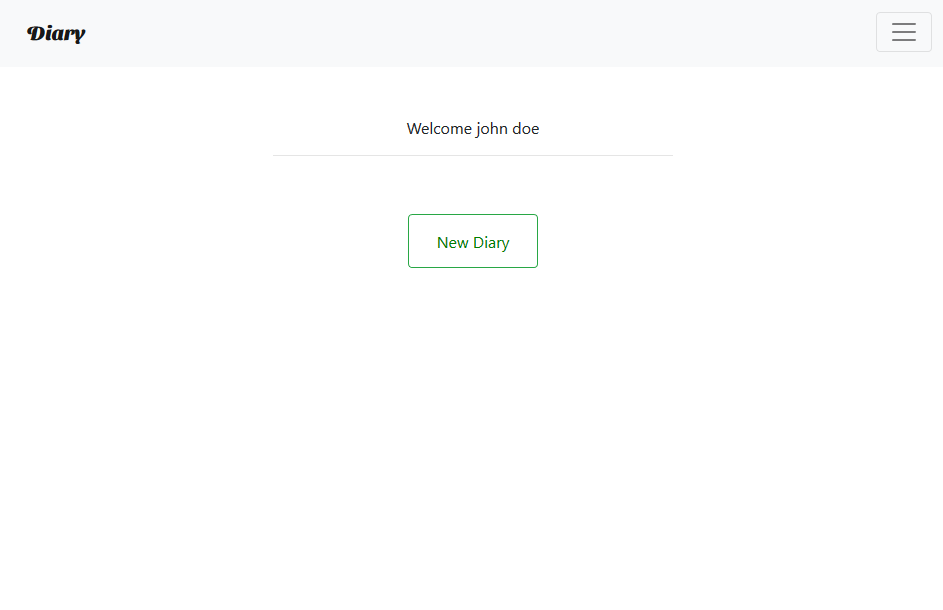

The Landing page after loging in

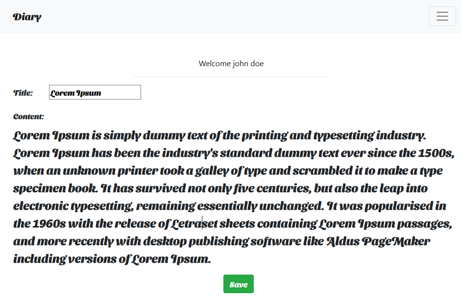

write your secrets , letter to your crush , letter to yourself and **save** it . 

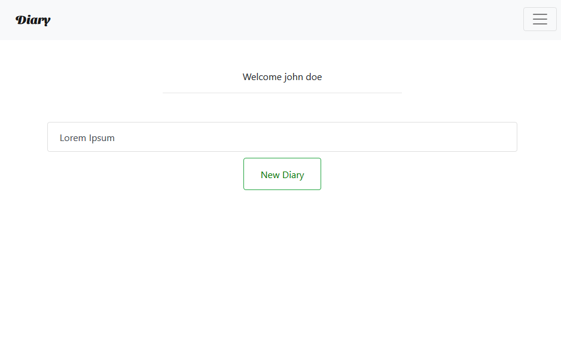

after saving , now the user is able to access the diary .

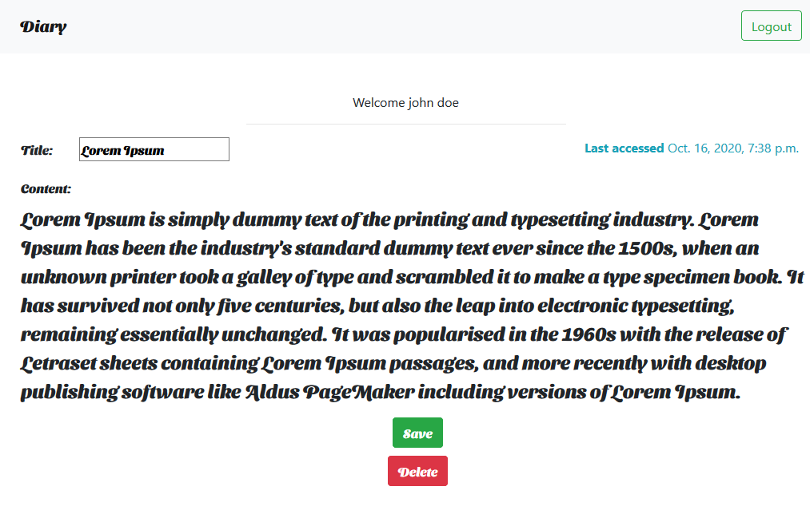

deletetion or updation of the diary .

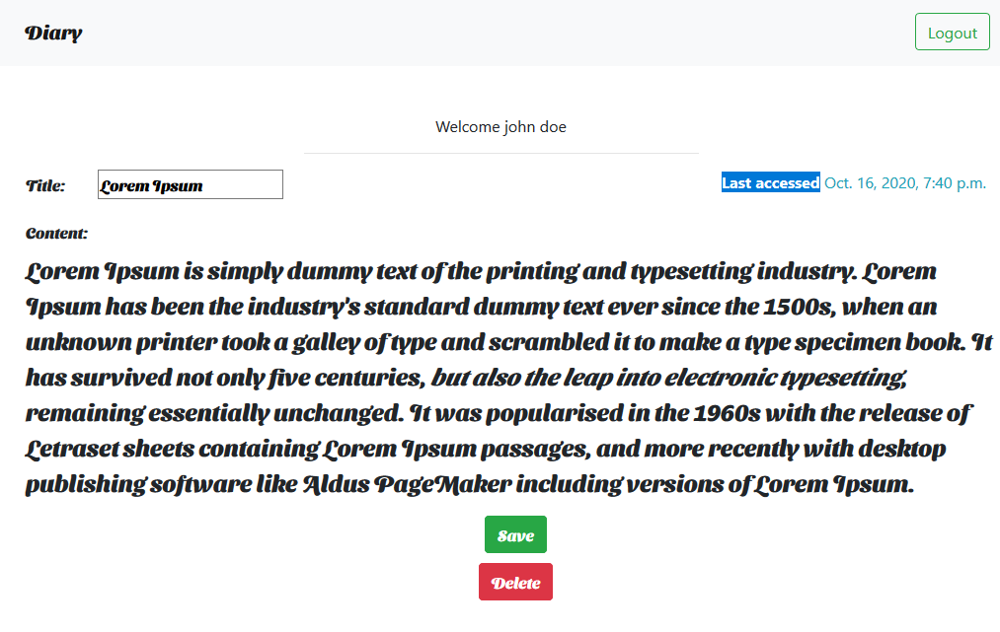

the last accessed date reveals the last time user performed action on it and also lists the diaries according to the latest diary accessed.

---

### Admin

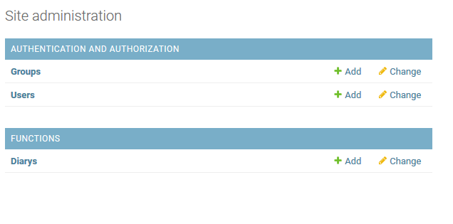

the admin page wont store any content from the user.

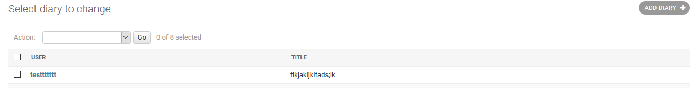

the users information is secure *as no person wants to reveal whats in their diary* .

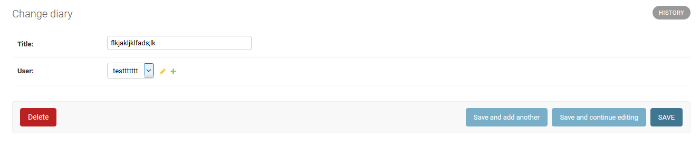

---

### Library used

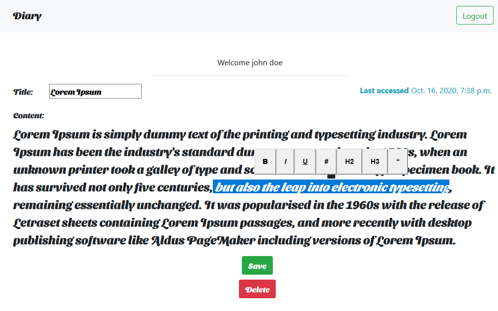

This is medium.com editor. Some kry features includes :
- Italicze text
- Boldens text
- put links
- put headings

support @ [medium editor](https://yabwe.github.io/medium-editor/)

